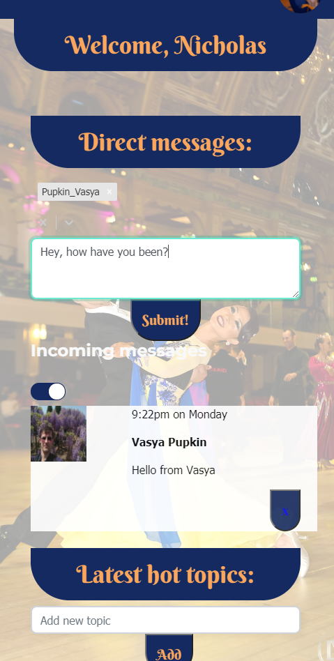
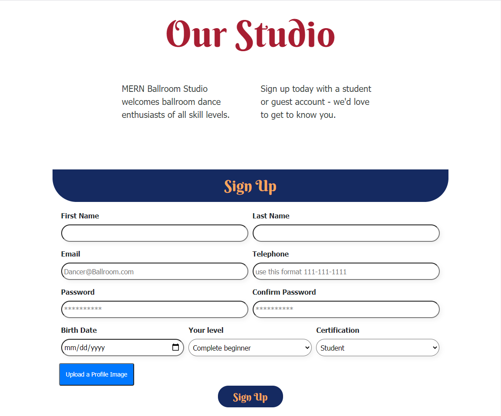
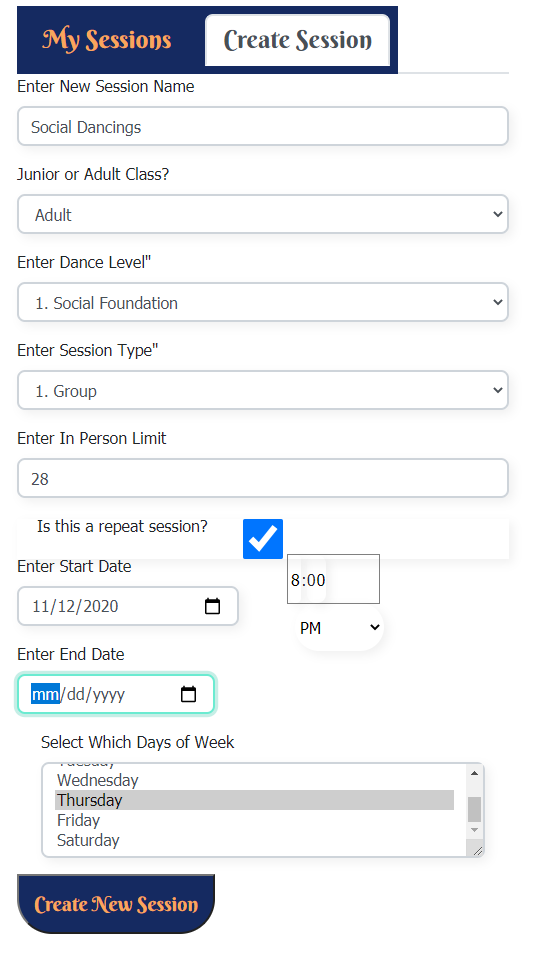
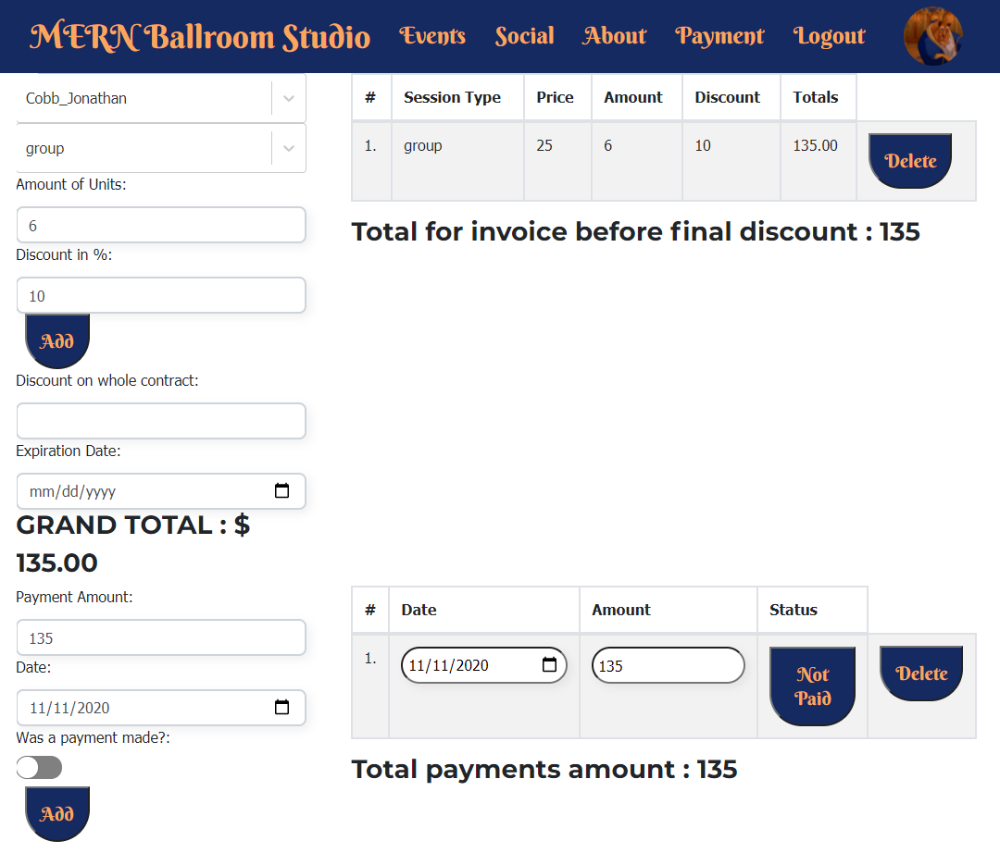

# MERN Studios

## Description

MERN Ballroom Studio is a group project using the MongoDB, Express, React and Node.js stack. 

Lesser technologies include Mongoose, Passport, BCryptJS, Nodemailer, React Hash Router, Cloudinary, UseState, and UseEffect, dotenv, Bootstrap, and more. 

This demonstrates full usage of the MERN Stack in a realistic scenario by creating a scheduling, billing, and community platform that is practical for nearly any type of event or class-based business or community.

Users are able to log in and create a personalized and customizable account from which they can view events, sign up for them, and communicate publicly and directly with other suers through the "Steps" social media platform. 

Instructors, managers and Administrators have the ability to create events, edit and remove users, generate invoices, and manage the community social platform. They can also send marketing and reminder e-mails to users in the database.  

## Deployed Site: 
https://mern-ballroom.herokuapp.com/

FUTURE UPDATES: 
- Integration with Google OAuth 
- Connecting the invoice system to Stripe
- Calendar functionality 

## Contributors 
[Sergey Bolotnikov](https://github.com/sbolotnikov)
[Michael Chen](https://github.com/mc4506)
[Jonathan Cobb](https://github.com/jmc846)
[Nicholas La Monaco](https://github.com/nlamonaco86)

## Table of Contents

* [Installation](#installation)
* [Usage](#usage)

## Installation

Simply clone the repo, and/or visit the deployed page link to begin.

## Usage
 
 
 
 

## Questions

Contact Us with any questions or suggestions!
 * Jonathan Cobb [jmc846](mailto:jmc846@scarletmail.rutgers.gmail.com)
 * Michael Chen [mc4506](mailto:mike4506@gmail.com)
 * Nicholas La Monaco [nlamonaco86](mailto:nlamonaco86@gmail.com)
 * Sergey Bolotnikov [sbolotnikov](mailto:sbolotnikov@gmail.com)